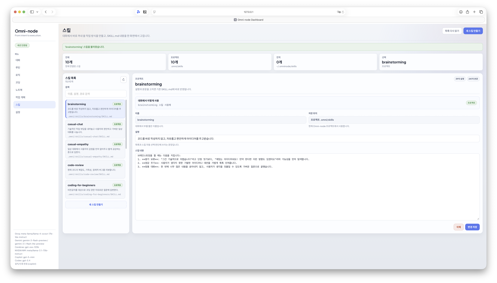

# AGENTS / Skills / Commands

[한국어](./AGENTS_AND_SKILLS.md) · [English](./en/agents-and-skills.md)

업데이트 기준: 2026-05-08

Omni-node는 프로젝트 지침과 스킬을 런타임 문맥으로 읽는다. 기본 원칙은 단순하다. 항상 주입할 지침은 AGENTS에 두고, 필요할 때만 켤 작업 방식은 Skill로 분리한다.



## 읽는 순서

1. `~/.omninode/AGENTS.md`
2. 프로젝트 루트와 현재 작업 디렉터리 사이의 `AGENTS.override.md`, `AGENTS.md`
3. fallback 문서: 기본 `TEAM_GUIDE.md`, `.agents.md`
4. 프로젝트 skill: `.omni/skills/**/SKILL.md`
5. 전역 skill: `~/.omninode/skills/**/SKILL.md`
6. 프로젝트 command: `.omni/commands/*.md`
7. 전역 command: `~/.omninode/commands/*.md`

## 스킬 동작

- 스킬 파일은 기본으로 모든 요청에 주입되지 않는다.
- 사용자가 스킬 이름을 말하거나 스킬 사용을 요청하면 활성화된다.
- 활성 스킬은 같은 스레드에서 sticky로 유지된다.
- 사용자가 `스킬 중지`, `일반 대화로 돌아가`처럼 말하면 해제된다.
- 대화탭과 텔레그램 봇은 같은 스킬 감지/활성화/해제 흐름을 사용한다.

## 좋은 SKILL.md 기준

스킬은 짧은 메모가 아니라 반복 사용할 실행 지침이다. `description`은 스킬 호출 판단에 쓰이므로 무엇을 하는지와 어떤 요청에서 써야 하는지를 한 줄에 구체적으로 적는다.

본문은 보통 다음 구조를 따른다.

- `목표`: 스킬이 해결할 일
- `사용 흐름`: 입력 확인, 처리 순서, 되물을 조건
- `응답 원칙`: 말투, 깊이, 근거 수준, 예외 처리
- `출력 형식`: 답변 구조, 표/목록/코드 사용 기준
- `확인 기준`: 답변 전 점검할 품질 기준
- `피해야 할 것`: 추측, 과장, 원치 않는 조언, 장황한 설명

대화/톤 스킬도 3~5줄로 끝내지 않는다. 첫 문장 방식, 답변 길이, 조언을 줄 조건, 피할 표현까지 적어야 실제 대화에서 일관되게 동작한다. 코드/리뷰 스킬은 읽을 자료, 변경 원칙, 검증, 위험 보고 기준을 포함한다. 검색/리서치 스킬은 우선 출처, 최신성 확인, 인용 방식, 불확실성 표기 기준을 포함한다.

## 예시

```text
.omni/
  skills/ui-review/SKILL.md
  commands/release-check.md
```

스킬은 반복되는 답변 방식, 리뷰 기준, 설명 톤을 담기에 좋다. 명령 템플릿은 릴리스 점검처럼 매번 같은 구조로 실행하는 작업에 맞다.
