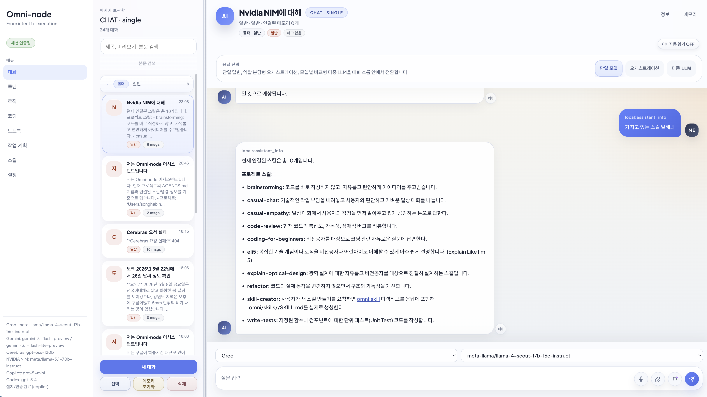

# Omni-node 5분 시작

[한국어](./QUICKSTART.md) · [English](./en/quickstart.md)

업데이트 기준: 2026-05-14

이 문서는 처음 실행할 때 필요한 것만 남긴 빠른 시작 가이드다. 자세한 기능 설명은 [사용법_빠른시작.md](./사용법_빠른시작.md)를 보면 된다.



## 1. 준비물

| 도구 | 용도 |
|---|---|
| `.NET SDK 9` | 미들웨어 빌드와 실행 |
| C 컴파일러 | `apps/omninode-core` 빌드 |
| `python3` | 샌드박스와 코딩 검증 |
| `node`, `npm` | 대시보드 회귀 테스트 |
| 선택: `gh`, `copilot`, `codex` | Copilot/Codex CLI 연동 |

LLM 키는 하나 이상만 있어도 시작할 수 있다. 키는 설정 탭에서 저장하거나 `*_FILE` 환경변수로 지정한다.

## 2. 실행

전역 실행기가 등록되어 있으면 macOS/Linux에서는 아래 두 개로 충분하다.

```bash
Omni-node
Omni-node shutdown
```

수동 실행은 두 단계다.

```bash
make -C apps/omninode-core
dotnet run --project apps/omninode-middleware/OmniNode.Middleware.csproj
```

Windows:

```powershell
.\apps\omninode-core\build.ps1
dotnet run --project apps\omninode-middleware\OmniNode.Middleware.csproj
```

## 3. 접속

- 대시보드: `http://127.0.0.1:8080/`
- health: `http://127.0.0.1:8080/healthz`
- ready: `http://127.0.0.1:8080/readyz`

처음 접속하면 WebSocket 세션은 OTP 대기 상태가 된다. 텔레그램이 설정되어 있으면 OTP를 텔레그램으로 받고, 로컬 개발 환경에서는 콘솔 fallback OTP를 사용할 수 있다.

## 4. 첫 확인 순서

1. 대시보드가 열리고 좌측 상태가 `연결됨 / OTP 대기`인지 본다.
2. 설정 탭에서 사용할 LLM 키 또는 CLI 인증 상태를 확인한다.
3. 대화 탭에서 짧은 질문을 보낸다.
4. 코딩 탭에서 작은 파일 생성 요청을 실행한다.
5. `readyz`와 `doctor --json`으로 상태를 확인한다.

## 5. 외부접속

외부접속은 기본 꺼짐이다. 로컬 대시보드의 설정 탭에서 토글을 켜면 같은 LAN의 다른 기기에서 접속할 수 있고, 설정 화면에 접속 주소가 표시된다. 외부 클라이언트도 OTP 인증을 거쳐야 하며, Telegram/LLM 키/CLI 인증 같은 민감 설정 화면과 서버 액션은 차단된다.
