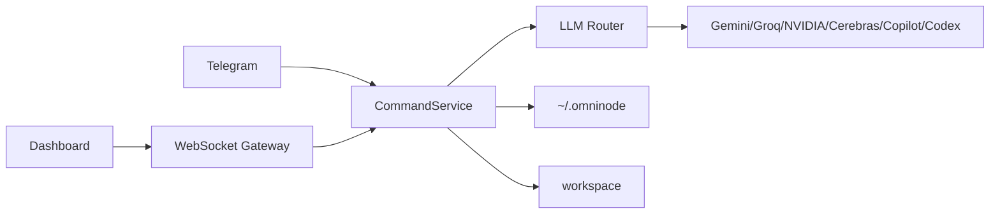

# Omni-node Architecture

[한국어](../아키텍처_흐름.md) · [English](./architecture.md)

Updated: 2026-05-15

Omni-node keeps the web dashboard and Telegram bot on the same command layer. That is the main design choice.

The core daemon is C11, the middleware is .NET 9, the dashboard is static web code, and executable artifacts live under `workspace/`.

Security boundaries are explicit: remote dashboard clients must authenticate with OTP, WebSocket requests pass an Origin gate and pre-auth message allowlist, `/api/local-image` only serves routine assets, attachments are rejected when they exceed count or size limits, and Markdown raw HTML is disabled.
