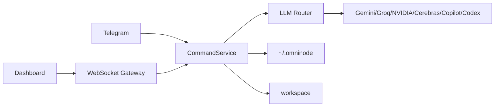

# Omni-node Architecture

[한국어](../아키텍처_흐름.md) · [English](./architecture.md)

Updated: 2026-05-19

Omni-node keeps the web dashboard and Telegram bot on the same command layer. That is the main design choice.

The core daemon is C11, the middleware is .NET 9, the dashboard is static web code, and executable artifacts live under `workspace/`.

Security boundaries are explicit: remote dashboard clients enter limited mode without an OTP prompt, remote OTP requests stay blocked, and remote WebSocket messages must pass a limited-mode allowlist before dispatch. The remote allowlist is read-oriented; chat, coding, routine, logic graph, task, refactor, and tool execution actions are blocked remotely. WebSocket requests pass an Origin gate and pre-auth message allowlist; missing Origin is allowed only for local loopback clients and rejected for remote clients. The default WebSocket message cap is 16 MB, `/api/local-image` only serves routine assets, attachments are rejected when they exceed count or size limits, and Markdown raw HTML is disabled. JSON state writes take a per-file `.lock` lease, replace files atomically, keep the previous valid file as `.bak`, and conversation, session, routine, routing policy, plan, task graph, Telegram outbox, guard retry timeline, and usage state stores attempt backup recovery when the primary JSON is corrupt. The workspace doctor check reports state JSON, backup, lock, corrupt JSON counts, and whether each listed corrupt file has a backup. Startup memory index sync failures do not block middleware startup; sync logs and manual rebuild results report total documents, memory/session/project source counts, indexed/skipped/removed counts, and elapsedMs. Explicit local code execution is allowed only when `OMNINODE_ENABLE_DYNAMIC_CODE=true`; missing dependency auto-install is disabled by default and only runs with `OMNINODE_ENABLE_AUTO_INSTALL=true`. The Python sandbox is a local execution limiter, not a full filesystem/network/environment sandbox. The C core IPC accepts only fixed `get_metrics` and `kill <pid>` line commands, and kill requests must pass middleware allowlist checks first.

## Remote Limited Mode Permission Table

Remote dashboard clients connect through LAN access enabled locally. This path does not request OTP and enters limited mode automatically. Limited mode allows settings state, conversation and memory read/search, context/skills/commands lists, notebook reads, routing policy operations, and model selection. It blocks chat/coding/routine/logic/task execution, refactor apply, tool execution, OTP or saved-token auth, CLI login/logout, Telegram/LLM key changes, and external-access toggle changes.

| Area | State | Details |
|---|---|---|
| Read features | Allowed | Settings state, conversation list/detail, memory note list/read/search, context/skills/commands lists, notebook reads |
| Models/routing | Partially allowed | Routing policy get/save/reset, last routing decision, model list, model selection |
| Work execution | Blocked | Chat/coding/routine/logic graph execution, task graph execution, refactor apply, tool execution |
| Auth | Blocked | OTP request, stored auth-token resume, Copilot/Codex CLI auth status, login, logout |
| Secret settings | Blocked | Telegram credential save/delete/test, LLM API key save/delete |
| External access settings | Blocked | External-access toggle changes |
