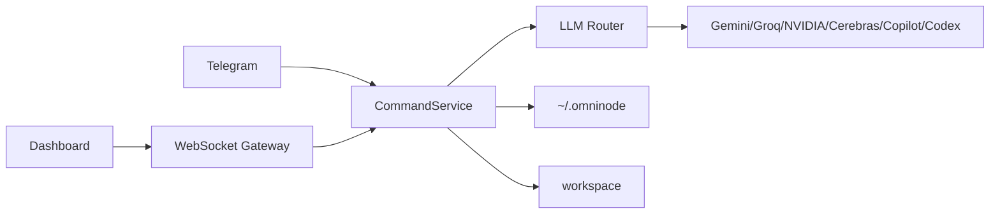

# Omni-node Architecture

[한국어](../아키텍처_흐름.md) · [English](./architecture.md)

Updated: 2026-05-08

Omni-node keeps the web dashboard and Telegram bot on the same command layer. That is the main design choice.

The core daemon is C11, the middleware is .NET 9, the dashboard is static web code, and executable artifacts live under `workspace/`.
