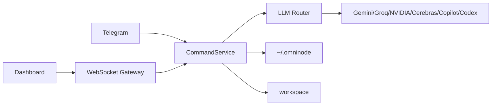

# Omni-node Architecture

[한국어](../아키텍처_흐름.md) · [English](./architecture.md)

Updated: 2026-05-15

Omni-node keeps the web dashboard and Telegram bot on the same command layer. That is the main design choice.

The core daemon is C11, the middleware is .NET 9, the dashboard is static web code, and executable artifacts live under `workspace/`.

Security boundaries are explicit: remote dashboard clients enter limited mode without an OTP prompt, remote OTP requests stay blocked, WebSocket requests pass an Origin gate and pre-auth message allowlist, `/api/local-image` only serves routine assets, attachments are rejected when they exceed count or size limits, and Markdown raw HTML is disabled.

## Remote Limited Mode Permission Table

Remote dashboard clients connect through LAN access enabled locally. This path does not request OTP and enters limited mode automatically.

| Area | State | Details |
|---|---|---|
| Work features | Allowed | Chat, coding, routine runs, notebooks, plans |
| Logic graphs | Allowed | List, open, path browse, save, delete, run, cancel, run-result lookup |
| Models/routing | Allowed | Routing policy get/save/reset, last routing decision, model list, model selection |
| Auth | Blocked | OTP request, stored auth-token resume, Copilot/Codex CLI auth status, login, logout |
| Secret settings | Blocked | Telegram credential save/delete/test, LLM API key save/delete |
| External access settings | Blocked | External-access toggle changes |
