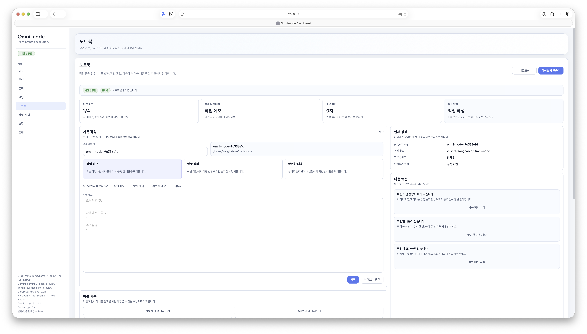
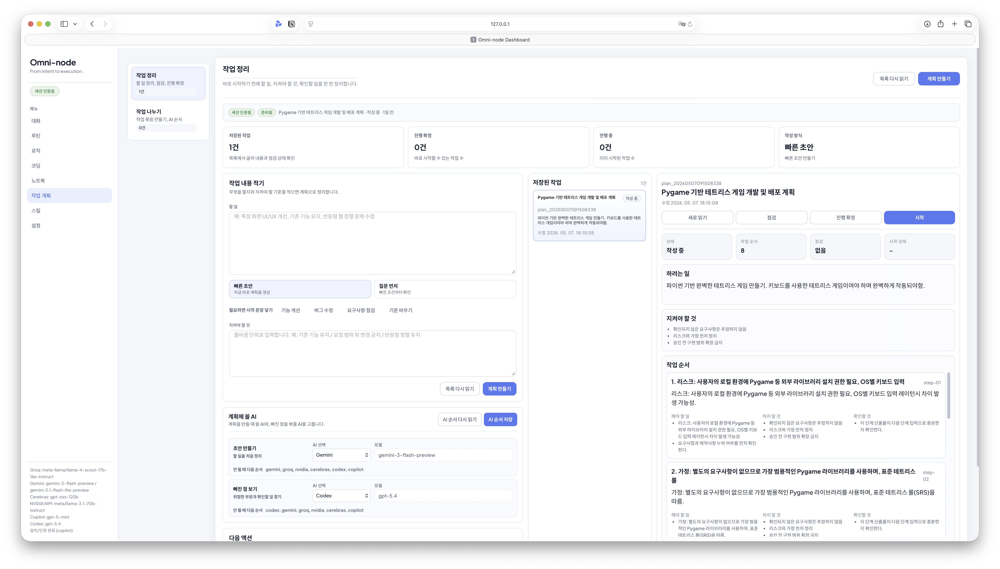
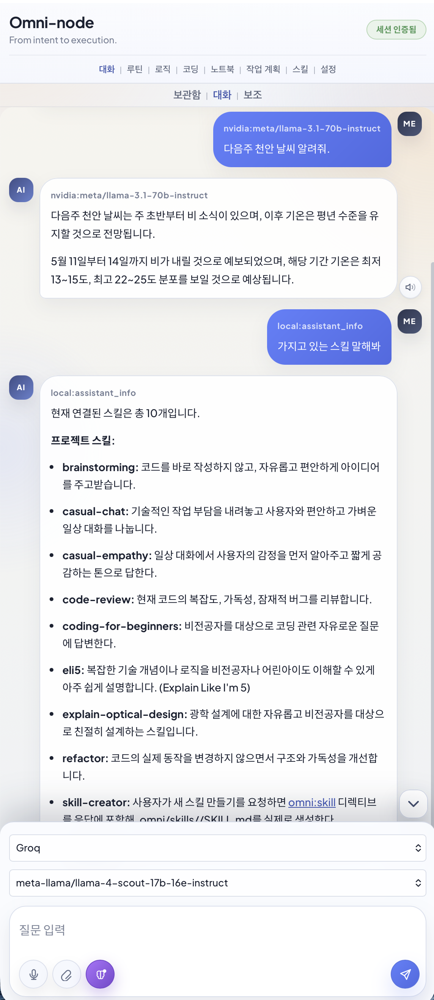
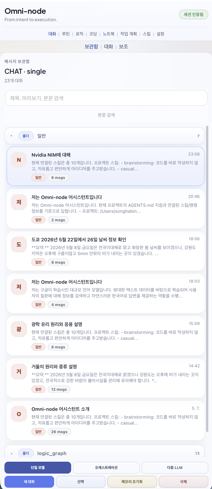

# Omni-node Usage

[한국어](../사용법_빠른시작.md) · [English](./usage.md)

Updated: 2026-05-08

## Chat

Chat supports single model, orchestration, multi-LLM comparison, Think+, URL/search/memory context, sticky skills, and TTS.

## Coding

Coding runs create real folders, files, commands, stdout/stderr, validation status, and recoverable recent-result snapshots.

## Routines and Logic

Routines handle natural-language creation, immediate runs, scheduled runs, browser-agent runs, and Telegram delivery.

Logic graphs connect chat, coding, routines, and tools on a node canvas.

## Notebooks and Plans

Notebooks keep learnings, decisions, verification notes, and handoff documents. Plans turn larger work into reviewed and executable task graphs.

## Mobile

| Closed | Open |
|---|---|
|  |  |
