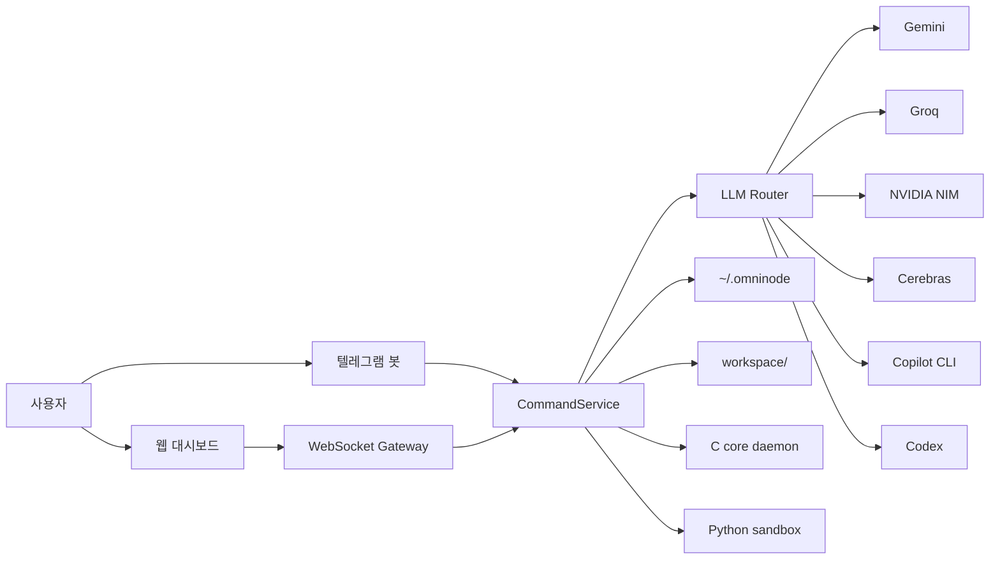

# Omni-node 아키텍처

[한국어](./아키텍처_흐름.md) · [English](./en/architecture.md)

업데이트 기준: 2026-05-15

Omni-node는 작게 나눈 구성요소를 WebSocket과 파일 상태 저장소로 묶는다. 핵심은 웹 대시보드와 텔레그램 봇이 서로 다른 제품처럼 동작하지 않고, 같은 명령 계층을 통과한다는 점이다.

## 구성요소

| 위치 | 역할 |
|---|---|
| `apps/omninode-core` | 단일 인스턴스와 로컬 코어 IPC를 담당하는 C11 데몬 |
| `apps/omninode-middleware` | .NET 9 서버, WebSocket/HTTP, 텔레그램, 라우팅, 상태 저장 |
| `apps/omninode-dashboard` | 정적 웹 대시보드 |
| `apps/omninode-sandbox` | 코드 실행 샌드박스 |
| `workspace/` | 코딩, 루틴, 로직, task graph 산출물 |
| `~/.omninode` | 설정, 대화, 루틴, 계획, 노트북 등 영속 상태 |

## 요청 흐름

1. 대시보드 또는 텔레그램에서 요청을 보낸다.
2. WebSocket Gateway나 Telegram loop가 같은 CommandService로 넘긴다.
3. CommandService가 대화, 코딩, 루틴, 계획, refactor 같은 도메인으로 분기한다.
4. LLM이 필요하면 LlmRouter가 provider와 fallback chain을 선택한다.
5. 결과는 대화 기록, 실행 폴더, runtime 로그, notebook 문서에 남는다.

## 안전 경계

- 시크릿은 환경변수, `*_FILE`, secure store, Keychain 경로로 분리한다.
- 외부접속 클라이언트는 OTP 요청 없이 제한 모드로 자동 승인되며, 민감 설정 UI와 인증/시크릿 관련 액션은 차단된다.
- WebSocket은 Origin 검사, 인증 전 메시지 allowlist, 명령 rate limit을 적용한다.
- `/api/local-image`는 루틴 자산 경로만 허용하고, 첨부는 개수/크기 한도를 넘으면 잘라내지 않고 거부한다.
- Markdown 렌더링은 raw HTML을 비활성화하고 안전 fallback을 사용한다.
- Safe Refactor는 preview 생성 후 apply 직전에 파일 상태를 다시 확인한다.
- 코딩 실행은 실행별 폴더를 따로 만들고, 생성 파일과 검증 명령을 남긴다.

## 외부접속 제한 모드 권한표

외부접속 클라이언트는 로컬에서 한 번 켜 둔 LAN 접속을 통해 들어온다. 이 경로에서는 OTP 요청을 시도하지 않고 제한 모드로 자동 진입한다.

| 구분 | 상태 | 내용 |
|---|---|---|
| 작업 기능 | 허용 | 대화, 코딩, 루틴 실행, 노트북, 작업 계획 |
| 로직 그래프 | 허용 | 로직 그래프 목록, 열기, 경로 탐색, 저장, 삭제, 실행, 취소, 실행 결과 조회 |
| 모델/라우팅 | 허용 | 라우팅 정책 조회/저장/초기화, 마지막 라우팅 결정 조회, 모델 목록 조회, 모델 선택 |
| 인증 | 차단 | OTP 요청, 저장된 인증 토큰 재개, Copilot/Codex CLI 인증 상태 조회, 로그인, 로그아웃 |
| 시크릿 설정 | 차단 | Telegram 자격 증명 저장/삭제/테스트, LLM API 키 저장/삭제 |
| 외부접속 설정 | 차단 | 외부접속 토글 변경 |
